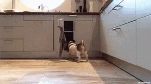

# 🚀 ' PaLao ᚾ

Some projects are mine and others are not since they are projects of external people in which I participate as a dev, so if you need to contact me you have my social networks.

## @Stack

## 🧳 Visitor Count

<table width="100%"> 

  <tr>

      
&nbsp;   )

  </table>

[//]: <> (The `&nbsp;` is to have Aphelion take up more space)
[//]: <> (Old Visits: https://badges.pufler.dev/visits/novatorem/novatorem?logo=GitHub&label=github%20visits&color=336699&logoColor=white&style=flat-square)

-----

CC: [@Jthnlp](https://github.com/dvPalao)

